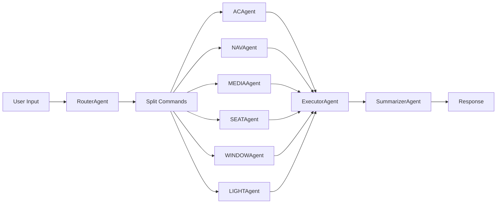

# Car Voice Assistant 🚗

An intelligent car voice assistant system based on Alibaba Cloud Qwen-Max, featuring LangGraph multi-agent architecture for vehicle control, navigation, and media playback. Includes a full-featured debugging workbench.

## Tech Stack

| Layer | Technology |
|-------|------------|
| **Backend API** | FastAPI + Uvicorn |
| **Agent Framework** | LangGraph (Multi-Agent) |
| **LLM** | Alibaba DashScope (Qwen-Max) |
| **Database** | SQLite + SQLAlchemy |
| **Frontend** | React 19 + TypeScript + Vite |
| **UI Components** | Ant Design 6.x |
| **I18n** | Built-in (EN/CN) |

## Architecture

```
┌─────────────────┐     HTTP API     ┌─────────────────────────────────────┐
│  React Frontend │ ◄──────────────► │         FastAPI + LangGraph         │
│  (localhost:5173)│                 │                                     │
└─────────────────┘                  │  ┌─────────┐    ┌──────────────┐   │
                                     │  │ Router  │───►│ Module Agents │   │
                                     │  │ Agent   │    │ AC/NAV/MEDIA  │   │
                                     │  └─────────┘    │ SEAT/WINDOW   │   │
                                     │       │         │ LIGHT         │   │
                                     │       ▼         └──────┬───────┘   │
                                     │  ┌─────────┐           │           │
                                     │  │Summarizer│◄─────────┘           │
                                     │  │ Agent   │                       │
                                     │  └─────────┘                       │
                                     └────────────────────────────────────┘
```

## Multi-Agent Workflow



## Project Structure

```
car_bot/
├── scripts/
│   └── preprocess.py           # Excel → JSON ETL
├── server/
│   ├── main_v2.py              # FastAPI + LangGraph API
│   ├── agents/
│   │   ├── base.py             # BaseAgent with token tracking
│   │   ├── router.py           # Command recognition
│   │   ├── executor.py         # Action execution
│   │   ├── summarizer.py       # Response merging
│   │   └── modules/            # Domain agents
│   │       ├── ac.py           # AC control (42 intents)
│   │       ├── nav.py          # Navigation
│   │       ├── media.py        # Media playback
│   │       ├── seat.py         # Seat control (17 intents)
│   │       ├── window.py       # Window control (17 intents)
│   │       └── light.py        # Light control (13 intents)
│   ├── graph/
│   │   ├── state.py            # AgentState definition
│   │   ├── nodes.py            # Workflow nodes
│   │   └── workflow.py         # LangGraph workflow
│   └── data/
│       └── knowledge_base.json # Rules + Intents (124 unique)
├── client/
│   └── src/
│       ├── App.tsx             # Main app (4 tabs)
│       ├── i18n.ts             # Internationalization
│       └── index.css           # Styles
├── docker-compose.yml          # Docker deployment
├── run_backend.sh              # Backend startup
└── run_frontend.sh             # Frontend startup
```

## Requirements

- Python 3.9+
- Node.js 18+
- DashScope API Key (Alibaba Cloud)

## Quick Start

### 1. Data Preprocessing (Optional)
```bash
python scripts/preprocess.py
```

### 2. Start Backend
```bash
# Using script
./run_backend.sh

# Or manually
cd server
source ../.venv/bin/activate
export DASHSCOPE_API_KEY="sk-..."
uvicorn main_v2:app --reload --port 8000
```

### 3. Start Frontend
```bash
# Using script
./run_frontend.sh

# Or manually
cd client
npm install
npm run dev
```

Access http://localhost:5173

## Docker Deployment

```bash
# Set API key
export DASHSCOPE_API_KEY="sk-..."

# Build and run
docker-compose up -d

# View logs
docker-compose logs -f
```

## API Endpoints

| Route | Method | Description |
|-------|--------|-------------|
| `/` | GET | Health check |
| `/knowledge` | GET | Get knowledge base |
| `/chat` | POST | Full chat (multi-agent) |
| `/chat/recognize` | POST | Module recognition only |
| `/chat/execute` | POST | Execute commands |
| `/logs` | GET | Query history logs |

### Chat Request Example
```bash
curl -X POST http://localhost:8000/chat \
  -H "Content-Type: application/json" \
  -d '{"message": "Turn on AC and navigate to office", "history": []}'
```

### Response Format
```json
{
  "reply": "AC turned on. Navigation to office started.",
  "commands": [
    {"module": "AC", "text": "Turn on AC"},
    {"module": "NAV", "text": "navigate to office"}
  ],
  "results": [
    {"module": "AC", "intent": "turn_on_ac", "action": "AC_ON", "reply": "AC turned on"},
    {"module": "NAV", "intent": "navigate", "action": "NAV_START", "reply": "Navigation started"}
  ],
  "latency_ms": 2500,
  "token_usage": {"input_tokens": 1800, "output_tokens": 120, "total_tokens": 1920},
  "log_id": 1
}
```

## Frontend Features

| Tab | Description |
|-----|-------------|
| **Chat** | Real-time conversation with execution details |
| **Trace** | Debug logs with type/module/keyword filters |
| **Knowledge** | Rules + Intents table with ability/feature filters |
| **API Docs** | Interactive API testing |

## Supported Modules

| Module | Intents | Examples |
|--------|---------|----------|
| AC | 42 | Turn on/off, temperature, fan speed, defrost |
| SEAT | 17 | Heating, ventilation, massage, position |
| WINDOW | 17 | Open/close, lock, sunroof, sunshade |
| LIGHT | 13 | Headlights, ambient light, brightness |
| NAV | - | Destination, route, POI search |
| MEDIA | - | Play, pause, volume, source |

## Key Features

- ✅ LangGraph multi-agent architecture
- ✅ Multi-command recognition & parallel execution
- ✅ Token usage tracking across agents
- ✅ Full debugging toolchain (trace visualization)
- ✅ Internationalization (English/Chinese)
- ✅ Knowledge-driven from Excel
- ✅ Docker deployment ready
- ✅ Interactive API documentation

## License

MIT
