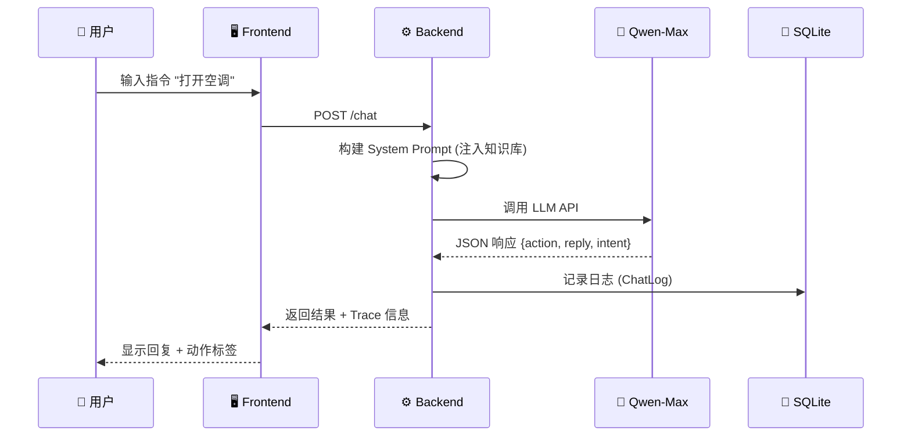
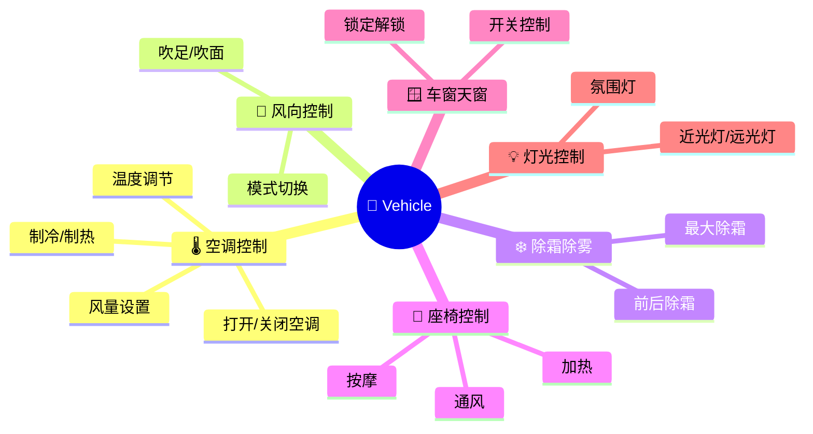

# Qwen Car Agent 🚗

基于阿里云通义千问 (Qwen-Max) 的智能车载语音助手系统，支持车辆控制、导航和媒体播放等功能，配备双屏工作台用于调试思维链。

## 技术栈

| 层级 | 技术 |
|------|------|
| **后端 API** | FastAPI + Uvicorn |
| **LLM** | 阿里云 DashScope (Qwen-Max) |
| **数据库** | SQLite + SQLAlchemy |
| **前端** | React 19 + TypeScript + Vite |
| **UI 组件** | Ant Design 6.x |
| **数据预处理** | Pandas + openpyxl |

## 架构概览

```
┌─────────────────┐     HTTP API     ┌─────────────────┐     DashScope     ┌─────────────┐
│  React Frontend │ ◄──────────────► │  FastAPI Server │ ◄───────────────► │  Qwen-Max   │
│  (localhost:5173)│                 │  (localhost:8000)│                   │    LLM      │
└─────────────────┘                  └────────┬────────┘                   └─────────────┘
                                              │
                                              ▼
                                     ┌─────────────────┐
                                     │  SQLite + JSON  │
                                     │  (日志 + 知识库)  │
                                     └─────────────────┘
```

## 数据流



## 项目结构

```
car_bot/
├── scripts/                    # 数据预处理
│   └── preprocess.py           # Excel → JSON 转换
├── server/                     # FastAPI 后端
│   ├── main.py                 # API 路由定义
│   ├── agent.py                # Qwen Agent 核心逻辑
│   ├── database.py             # SQLite 日志表定义
│   └── data/
│       └── knowledge_base.json # 知识库 (规则 + 意图)
├── client/                     # React 前端 (Vite + AntD)
│   └── src/
│       ├── App.tsx             # 主应用组件
│       └── index.css           # 样式文件
├── VR_Feature_List_demo.xlsx   # 原始数据源
└── car_bot.db                  # SQLite 日志数据库
```

## 环境要求

- Python 3.9+
- Node.js 16+
- DashScope API Key (阿里云)

## 快速启动

### 1. 数据预处理 (可选)
知识库已生成，如需重新处理：
```bash
python scripts/preprocess.py
```

### 2. 启动后端
```bash
cd server
python -m venv .venv
source .venv/bin/activate
pip install -r requirements.txt

export DASHSCOPE_API_KEY="sk-..."
uvicorn main:app --reload --port 8000
```

### 3. 启动前端
```bash
cd client
npm install
npm run dev
```
访问 http://localhost:5173

## API 接口

| 路由 | 方法 | 功能 |
|------|------|------|
| `/` | GET | 健康检查 |
| `/knowledge` | GET | 获取知识库 |
| `/chat` | POST | 对话处理 |
| `/logs` | GET | 查询历史日志 |

### 对话请求示例
```bash
curl -X POST http://localhost:8000/chat \
  -H "Content-Type: application/json" \
  -d '{"message": "打开空调", "history": []}'
```

### 响应格式
```json
{
  "reply": "好的，已为您打开空调",
  "action": {"action": "AC_ON"},
  "trace": {"latency_ms": 1200, "token_usage": {...}},
  "log_id": 1
}
```

## 数据库结构 (ChatLog)

| 字段 | 类型 | 说明 |
|------|------|------|
| `user_input` | Text | 用户输入 |
| `intent_detected` | String | 检测到的意图 |
| `full_prompt` | Text | 完整 Prompt |
| `raw_response` | Text | LLM 原始响应 |
| `parsed_action` | JSON | 解析后的动作 |
| `latency_ms` | Integer | 延迟 (毫秒) |
| `token_usage` | JSON | Token 用量 |

## 知识库内容

### 车辆控制规则 (5 条)
- 硬件不支持时回复 "暂不支持此技能"
- 支持各位置独立控制 (主驾/副驾/前排/后排)
- 车辆未启动时拒绝空调相关命令

### 支持的功能领域



## 前端功能

1. **对话界面**: 实时聊天 + 快捷指令
2. **思维链查看**: Prompt / Token / 延迟 / cURL
3. **知识库展示**: 规则列表 + 意图表格

## 项目亮点

- ✅ 完整的调试工具链 (思维链可视化)
- ✅ 结构化 JSON 输出，便于后续处理
- ✅ 多位置支持 (主驾/副驾/前后排)
- ✅ 知识库驱动，从 Excel 自动生成
- ✅ 保留最近 5 轮对话上下文
